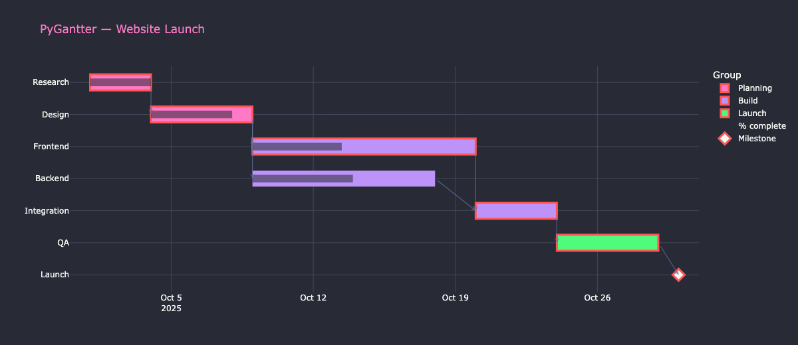
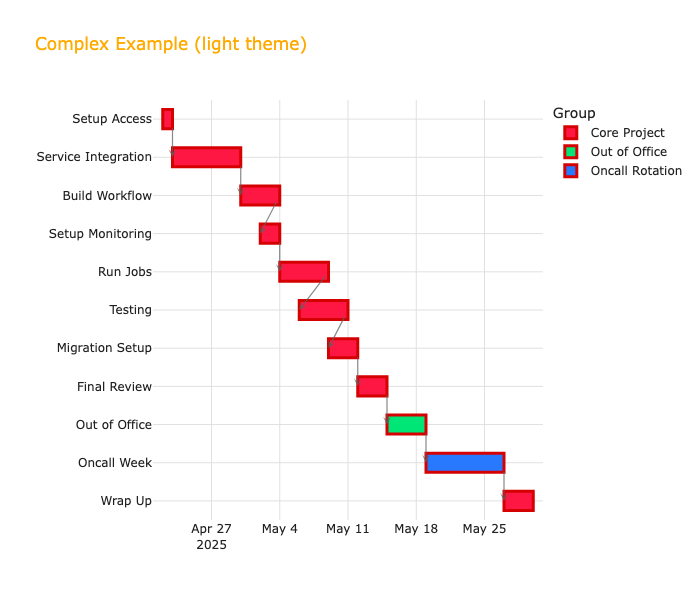
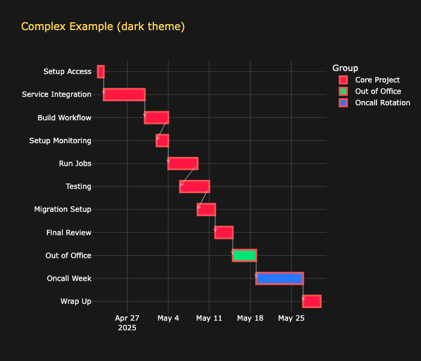
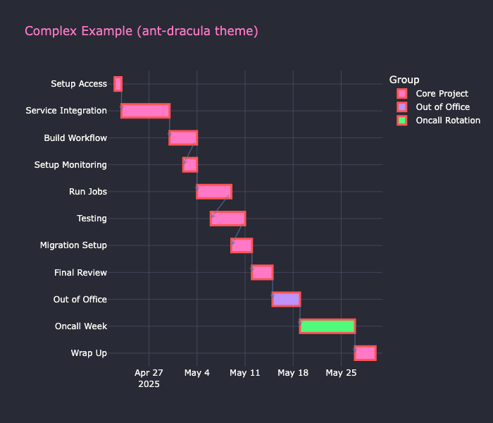

<div align="center">

# PyGantter

**Turn a plain CSV, TSV, or JSON task list into a project Gantt chart, with critical path, dependencies, milestones, and progress, in one command.**

[](https://github.com/Adi-UA/PyGantter/actions/workflows/test.yml)




</div>

PyGantter reads a task file, works out which tasks drive your deadline, and renders a
themed chart to PNG, SVG, PDF, or interactive HTML. You describe the work; it computes
the schedule and draws it.

## Features

- **Critical path** computed automatically and outlined in red, so you see which tasks
  cannot slip without moving the end date.
- **Dependency arrows** drawn from each prerequisite to the task that waits on it.
- **Milestones** (zero-duration tasks) rendered as diamonds.
- **Percent-complete overlay** on each bar to compare planned versus actual progress.
- **Today marker** so a live plan shows where "now" falls.
- **Flexible input**: CSV, TSV, or JSON, with forgiving date parsing (ISO `2025-10-01`,
  US `10/01/2025`, or written `Oct 1 2025`).
- **Effort or end date**: give an explicit `End`, or an `Effort` in days and let
  PyGantter compute the end.
- **Clear validation**: missing fields, unknown dependencies, self-references, and
  dependency cycles all fail with a readable message instead of a stack trace.
- **Three themes**: `light`, `dark`, `ant-dracula`.

## Installation

```bash
git clone https://github.com/Adi-UA/PyGantter.git
cd PyGantter
python -m venv .venv && source .venv/bin/activate   # Windows: .venv\Scripts\Activate.ps1
pip install .
```

Static image export (PNG, SVG, PDF) uses [Kaleido](https://github.com/plotly/Kaleido),
which renders through a headless Chrome. Install one once:

```bash
plotly_get_chrome -y
```

HTML output needs no browser. If you only ever export HTML you can skip that step.

## Quickstart

```bash
# PNG with everything on (critical path, arrows, progress, milestones)
pygantter sample_inputs/tasks.csv --output gantt.png --theme ant-dracula

# Interactive HTML, no browser needed to render it
pygantter sample_inputs/tasks.json --output gantt.html

# A cleaner static view: drop the progress overlay and today line
pygantter sample_inputs/tasks.csv -o plan.svg --no-progress --no-today
```

`sample_inputs/` ships ready-to-run files (`tasks.csv`, `tasks.tsv`, `tasks.json`, and a
larger `complex.*`). Try them immediately after install.

### CLI options

| Option | Description |
| --- | --- |
| `input` (positional) | Input file: `.csv`, `.tsv`, or `.json`. |
| `-o, --output` | Output path. Format inferred from the extension. |
| `--title` | Chart title. |
| `--theme` | `light`, `dark`, or `ant-dracula`. |
| `--format` | Force output format (`png`, `svg`, `pdf`, `html`). |
| `--no-critical-path` | Do not highlight the critical path. |
| `--no-dependencies` | Do not draw dependency arrows. |
| `--no-progress` | Do not draw percent-complete overlays. |
| `--no-today` | Do not draw the today marker. |
| `--preview` | Open the chart before saving. |
| `-f, --force` | Overwrite an existing output file. |
| `--version` | Print the version and exit. |

## Input schema

Only `Task` and `Start` are required. Every other column is optional.

| Column | Required | Meaning |
| --- | --- | --- |
| `Task` | yes | Unique task name. Dependencies reference this. |
| `Start` | yes | Start date (ISO, US, or written). |
| `End` | one of End/Effort | End date. Equal to `Start` means a milestone. |
| `Effort` | one of End/Effort | Duration in days. Used to derive `End` when `End` is absent. |
| `Dependencies` | no | Task names this task waits on. Comma-separated in CSV/TSV, a list in JSON. |
| `Group` | no | Swimlane / phase. Drives bar color and the legend. |
| `Progress` | no | Percent complete. Accepts `40`, `40%`, or `0.4`. |
| `Resource` | no | Owner, shown on hover. |

### CSV

```csv
Task,Start,End,Effort,Dependencies,Group,Progress,Resource
Research,2025-10-01,2025-10-04,,,Planning,100,Priya
Design,2025-10-04,,5,Research,Planning,80,Priya
Frontend,2025-10-09,2025-10-20,,Design,Build,40,Alice
Backend,2025-10-09,2025-10-18,,Design,Build,55,Bob
Integration,2025-10-20,2025-10-24,,"Frontend,Backend",Build,0,Alice
QA,2025-10-24,2025-10-29,,Integration,Launch,0,Bob
Launch,2025-10-30,2025-10-30,,QA,Launch,0,Team
```

`Design` has no `End`; PyGantter derives it from `Start + 5 days`. `Launch` has
`Start == End`, so it renders as a milestone diamond.

### JSON

```json
[
  { "Task": "Research", "Start": "2025-10-01", "End": "2025-10-04", "Group": "Planning", "Progress": 100 },
  { "Task": "Design", "Start": "2025-10-04", "Effort": 5, "Dependencies": ["Research"], "Group": "Planning", "Progress": 80 },
  { "Task": "Launch", "Start": "2025-10-30", "End": "2025-10-30", "Dependencies": ["QA"], "Group": "Launch" }
]
```

## How it works

PyGantter is a small pipeline. Each stage is its own module, so the schedule math is
separate from parsing and from drawing.

```
input file
   │  parser.py       read CSV/TSV (pandas) or JSON, then normalize + validate
   ▼
List[Task]            typed rows (models.py): dates parsed, End derived from Effort,
   │                  progress normalized, dependencies split
   │  schedule.py     build a dependency graph and analyze it
   ▼
Schedule              which tasks are on the critical path, and each task's slack
   │  chart.py        px.timeline base + feature overlays
   ▼
plotly Figure
   │  image.py        Kaleido writes PNG/SVG/PDF, or Plotly writes HTML
   ▼
output file
```

### 1. Parse and validate

`parser.py` loads rows, then builds a typed `Task` for each. Dates go through
`python-dateutil`, so ISO, US, and written formats all work. If a task has an `Effort`
but no `End`, the end is `Start + Effort` days. Validation rejects missing `Task`/`Start`,
duplicate names, an `End` before `Start`, dependencies that point at a task that does not
exist, and a task that depends on itself.

### 2. Build the dependency graph and order it

Each task lists the tasks it waits on, which is a directed edge from prerequisite to
dependent. That is a graph. To schedule it, the tasks are sorted into a
**dependency-first (topological) order** with Kahn's algorithm: repeatedly take a task
whose prerequisites are all placed, then remove it from the graph.

This ordering step is also how cycles are caught. If tasks depend on each other in a
loop (A needs B, B needs C, C needs A), no task ever becomes "ready", so the ordering
ends with tasks left over. PyGantter reports those tasks as a cycle instead of trying to
draw an impossible schedule. (A depth-first traversal detects the same loop by finding a
back edge to a node still on the current path; Kahn's queue-based version is used here
because it needs no recursion and yields the schedule order for free.)

### 3. Find the critical path

With tasks in order, `schedule.py` runs the **Critical Path Method (CPM)**, two passes
over the graph:

- **Forward pass** (in topological order): each task's earliest start is the latest
  earliest-finish among its prerequisites; its earliest finish is that plus its duration.
  The largest earliest-finish is the project length.
- **Backward pass** (in reverse order): each task's latest finish is the earliest
  latest-start among the tasks that depend on it; its latest start is that minus its
  duration.

A task's **total float** is `latest start − earliest start`: how long it can slip before
the project slips. Tasks with zero float form the **critical path** and are outlined in
red. In the sample above, `Backend` (Oct 9 to Oct 18) finishes before `Frontend`
(Oct 9 to Oct 20), so `Backend` has slack and is not on the critical path, while
`Research → Design → Frontend → Integration → QA → Launch` is.

### 4. Render and export

`chart.py` builds the base bars with `plotly.express.timeline` (the supported successor
to the deprecated `figure_factory.create_gantt`), colors them by group, then layers on
the critical-path outlines, dependency arrows, progress overlays, milestone diamonds, and
the today line. The x-axis is pinned to the task span so a far-off today marker cannot
squash the bars. `image.py` writes the figure to an image via Kaleido, or to
self-contained HTML.

## Themes

| Light | Dark | Ant Dracula |
| --- | --- | --- |
|  |  |  |

## Development

```bash
pip install -e ".[dev]"     # editable install with pytest + ruff
plotly_get_chrome -y        # once, for PNG export tests
pytest                      # run the suite
ruff check pygantter tests  # lint
python scripts/generate_examples.py   # regenerate sample_outputs/
```

Tests that need static image export skip automatically when no headless Chrome is
present, so the logic suite runs anywhere.

## License

MIT
