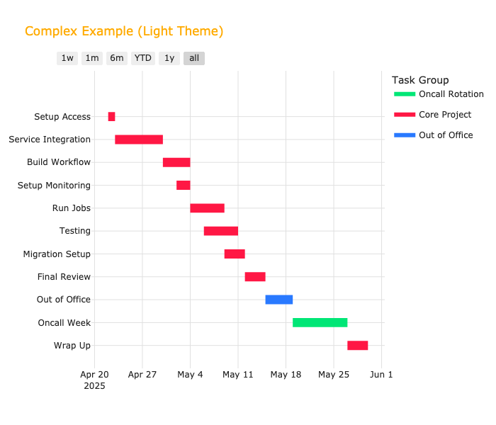

# PyGantter

## Contributions

Contributions are welcome! Feel free to fork the repository, submit issues, or create pull requests.


PyGantter is a Python tool for converting CSV, TSV, or JSON task files into Gantt chart images. It supports flexible input schemas and 3 color schemes: light, dark, and ant-dracula.

## Installation

```bash
pip install .
```

## Usage

```bash
python -m pygantter.cli --input tasks.csv --output gantt.png
```

### CLI Options

- `--input`: Input file (CSV, TSV, or JSON)
- `--output`: Output image file (PNG or SVG)
- `--title`: Chart title
- `--theme`: Color theme (light, dark)
- `--format`: Output format (png or svg)
- `--preview`: Preview chart before saving
- `--force`: Overwrite output file
- `--help`: Show help
- `--version`: Show version

## Input Schema Examples

### Input Formats: CSV, TSV, and JSON

Below are examples of the supported input formats:

#### CSV Example

```csv
Task,Start,End,Dependencies,Group
Design,10/01/2025,10/05/2025,,Alice's Tasks
Develop,10/03/2025,10/08/2025,Design,Bob's Tasks
Test,10/06/2025,10/10/2025,Develop,Alice's Tasks
```

#### TSV Example

```tsv
TaskStartEndDependenciesGroup
Design10/01/202510/05/2025Alice's Tasks
Develop10/03/202510/08/2025DesignBob's Tasks
Test10/06/202510/10/2025DevelopAlice's Tasks
```

#### JSON Example

```json
[
  {
    "Task": "Design",
    "Start": "10/01/2025",
    "End": "10/05/2025",
    "Dependencies": [],
    "Group": "Alice's Tasks"
  },
  {
    "Task": "Develop",
    "Start": "10/03/2025",
    "End": "10/08/2025",
    "Dependencies": ["Design"],
    "Group": "Bob's Tasks"
  },
  {
    "Task": "Test",
    "Start": "10/06/2025",
    "End": "10/10/2025",
    "Dependencies": ["Develop"],
    "Group": "Alice's Tasks"
  }
]
```


## Complex Example

A more advanced Gantt chart example is available in `sample_inputs/complex.csv`.

```bash
python -m pygantter.cli --input sample_inputs/complex.csv --output complex_example.png --title "Complex Timeline"
```

Preview of the first few rows:

```csv
Task,Start,End,Dependencies,Group
Setup Access,04/22/2025,04/23/2025,,Core Project
Service Integration,04/23/2025,04/30/2025,Setup Access,Core Project
Build Workflow,04/30/2025,05/04/2025,Service Integration,Core Project
...
```


## Themes

PyGantter supports light, dark, and ant-dracula themes. See `pygantter/themes.py` for customization.

## Example Outputs

### Light Theme



### Dark Theme


### Ant Dracula Theme


## Example Command

```bash
python -m pygantter.cli --input tasks.json --output gantt.svg --theme dark --preview
```

## License

MIT
